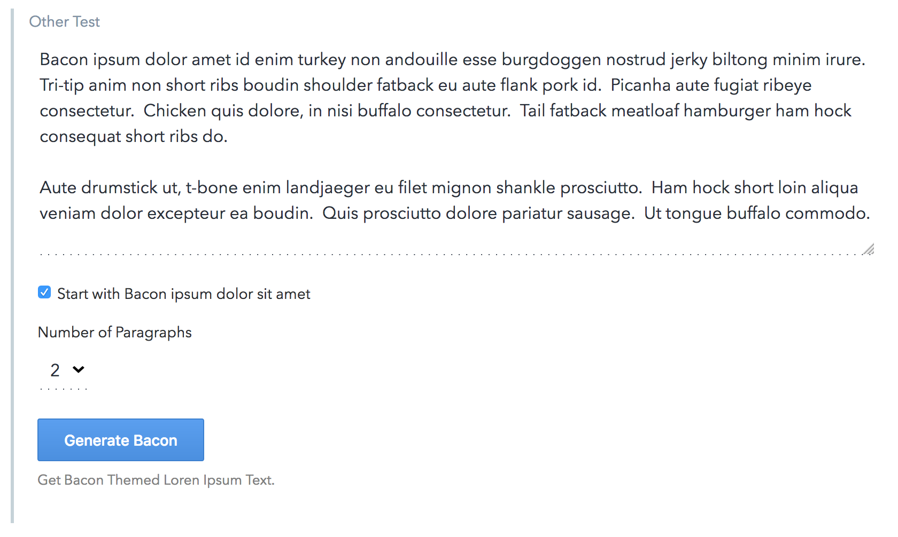

# Bacon Ipsum UI Extension

## Summary
This extension hits the [BaconIpsum API](http://baconipsum.com/) and uses it to generate Bacon themed Lorem Ipsum text.

## Description

The extension lets you select how many paragraphs to generate and if the created text should start with `Bacon ipsum dolor sit amet`.

You can install this extension via the [Contentful Comand line tool](https://github.com/contentful/contentful-cli) or by utilizing the inbrowser [UI extension installer](https://www.contentful.com/developers/docs/concepts/uiextensions/).
